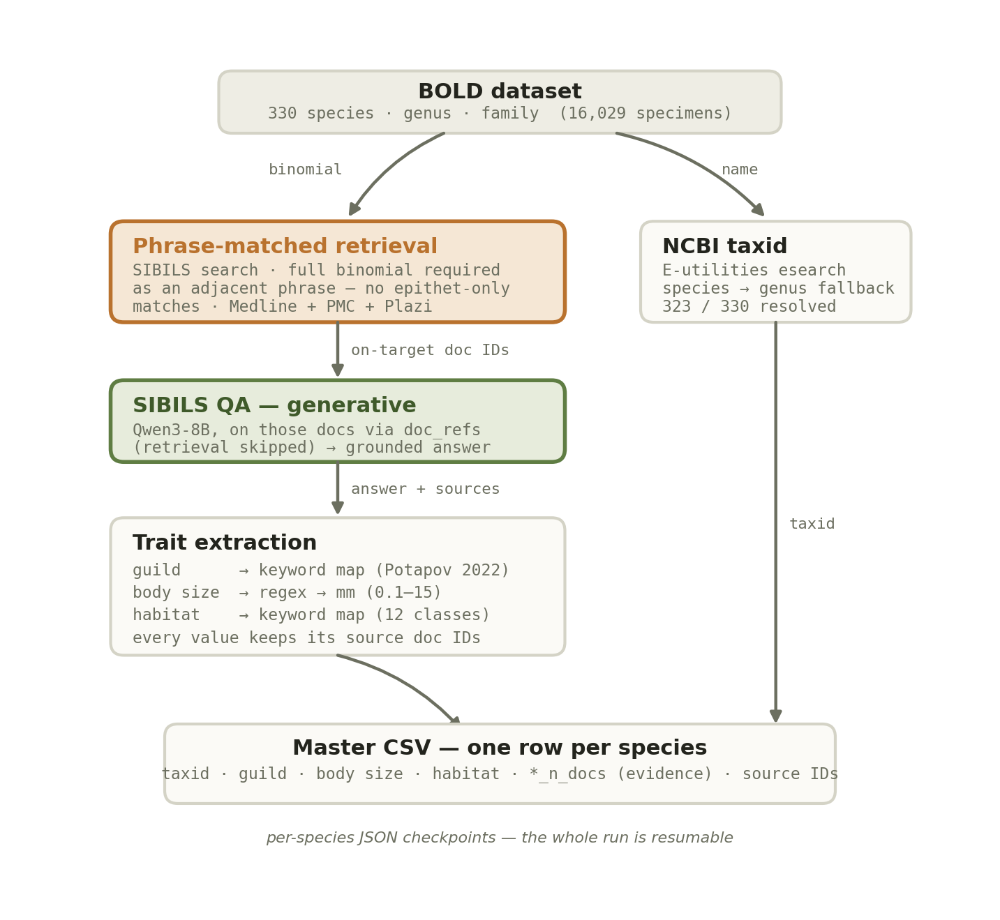

# Collembola functional traits from literature (SIBiLS QA)

Species-level functional-trait annotations for **330 Collembola species** (from a BOLD COI
barcode dataset), mined from the published literature with the [SIBiLS](https://sibils.org)
question-answering service. Three traits are covered — **trophic guild, body size and
habitat** — and every value is traceable to the source documents it came from. NCBI
Taxonomy IDs are included so the taxonomic path of each taxon can be verified.

**Version 3** (September 2026) follows a detailed review by Matteo Montagna and Paola
Costagliola (University of Naples Federico II), who checked the v2 values against the cited
sources. Their central finding was that a value can come from the right document and still
be wrong: a measurement belonging to a congeneric species, a diet inferred from the
substrate an animal was collected from, a habitat inferred from a collection locality. v3
addresses this by extracting claims rather than keywords, and by separating what the
literature states from what it merely suggests.

## What changed in v3

Extraction now works sentence by sentence and asks three questions of every candidate
value:

1. **Is the target species the subject of this sentence**, or is it another taxon? A
   measurement is attributed to the nearest taxon named before it, so a length belonging to
   a congener is no longer assigned to the target.
2. **Does the sentence assert the value, or hedge or deny it?** Answers often state a value
   and then retract it. *Stenaphorura quadrispina* is a clear case: the source gives 1330
   um, then says the measurement belongs to *S. lubbocki* and that the target's length is
   not stated. A denial anywhere in an answer now blocks promotion of any value from it.
3. **What kind of evidence is it?** Direct observation, a laboratory feeding trial,
   co-occurrence in a substrate, or a predation relationship running the other way.

Occurrence is no longer treated as diet, geography is no longer treated as habitat, and
laboratory evidence is retained but marked.

**Nothing is discarded.** Values that fail these tests move to an `*_indirect` column with
the reason recorded, so the evidence remains available without being presented as an
established trait.

## Data

[`collembola_species_traits_v3.csv`](collembola_species_traits_v3.csv) — one row per
species (330 rows). The v2 file is kept as `collembola_species_traits_v2.csv` for
comparison.

### Identification

| Column | Description |
|---|---|
| `species`, `genus`, `family` | Taxonomy as recorded in BOLD |
| `ncbi_taxid` | NCBI Taxonomy ID |
| `taxid_matched_rank` | `species` = exact match · `genus` = species absent from NCBI, genus ID used · empty = unresolved |

### Traits

Each of the three traits carries the same six columns.

| Column | Description |
|---|---|
| `trophic_guild` / `body_size_mm` / `habitat` | **The value.** Explicit, species-specific evidence only. |
| `*_indirect` | Values that did not meet that standard, kept with their reason |
| `*_evidence_type` | `direct` (observation or field study) or `experimental` (laboratory feeding trial) |
| `*_note` | Why a value was demoted, or what qualifies it — e.g. "body size of the target species not available; the value reported in the source is for *Friesea major*" |
| `*_n_docs` | Species-specific documents behind the answer (0 = no species-specific evidence) |
| `*_sources`, `*_qa_answer` | Source document IDs (PMID / PMCID / Plazi) and the grounded QA answer |

Trophic guilds follow Potapov et al. 2022 (*Soil Biology & Biochemistry*): fungivore,
bacterivore, microbivore, algivore, herbivore, detritivore, predator, omnivore. Habitat
classes: soil, leaf_litter, moss_lichen, cave, forest_wood, grassland, freshwater,
floodplain, marine_coastal, alpine_glacier, agricultural, synanthropic, sandy_dune.

### Specimen metadata

Geography, collection date and life stage are recorded per specimen in the BOLD source and
are aggregated here per species. They are **not** literature-mined, and are reported
separately for that reason. `bold_habitat` is BOLD's own field-recorded habitat, which
gives an independent reference against which the literature-mined `habitat` column can be
compared.

| Column | Description |
|---|---|
| `bold_n_specimens` | Barcode records for the species |
| `bold_life_stage`, `bold_habitat`, `bold_sampling_protocol` | As recorded by the collectors |
| `bold_country`, `bold_province`, `bold_coord`, `bold_elev_m` | Collection geography |
| `bold_collection_dates` | Year range of collection |
| `bold_biome`, `bold_ecoregion` | Biogeographic context |

## Results at a glance

| | v2 | v3 primary | v3 indirect |
|---|---:|---:|---:|
| Trophic guild | 40 | **15** | 23 |
| Body size | 27 | **15** | 11 |
| Habitat | 221 | **149** | 92 |
| NCBI taxid resolved | 323 | 323 | |

The primary counts are lower because the reviewers rejected 68% of v2 trophic guilds and
56% of v2 body sizes. Fewer values, each one defensible, with the rejected evidence still
visible in the indirect columns.

Specimen metadata, newly included: life stage for 281 species, field habitat and
coordinates for all 330, collection year range for 320.

## Evaluation

The review was encoded as 56 adjudicated species-trait pairs and used as a test set.

| | |
|---|---:|
| Rejected value no longer assigned | **49 / 56 (88%)** |
| Reviewer's expected value reached | 42 / 56 (75%) |

The gap between the two is informative. Removing a wrong value is something extraction can
do on its own. Recovering the *right* value often cannot be done from a cached answer,
because the answer summarises the document rather than reproducing it — the reviewers were
reading full sources. Those cases need the question re-asked against the source text, which
is the next step rather than a limitation of the approach.

## Method

For each species and trait, retrieval **requires the full binomial as an adjacent phrase**
(genus + specific epithet linked) across Medline, PMC and Plazi, so the specific epithet
alone can never match a different organism sharing it (*polaris* → the stonefly
*Arcynopteryx polaris*; *gibbosa* → the snail *Chilina gibbosa*). Trait-relevant terms are
added as a ranking boost. A generative SIBiLS QA answer (Qwen3-8B) is produced from exactly
those documents, and claim-level extraction derives the structured values described above.
NCBI taxids come from E-utilities `esearch`, falling back to the genus ID when the species
name is absent from NCBI Taxonomy.

If no document mentions the full binomial, the trait is left blank. No information from a
different taxon is ever assigned to a species.

## Known limitations

Read the QA answer and follow the source IDs before relying on any value.

- **Sparse where the literature is silent.** Most species have documents that mention them,
  typically Plazi taxonomic treatments, that never state diet or size. Those rows are empty
  rather than borrowing from a congener. This is deliberate.
- **The QA answer can overstate its source.** In a few cases the answer asserts a habitat or
  a measurement more confidently than the underlying document supports. Claim-level
  extraction cannot detect this, because the overstatement is already in the text it reads.
  These are the cases behind the 88%/75% gap.
- **Body size remains under-recovered.** Plazi taxonomic treatments carry many measurements
  that a dedicated pass over the treatment structure, rather than over a summary answer,
  could mine far more completely.
- **Habitat is multi-label and keyword-derived.** Categories resting only on a general term
  ("coastal", "marine") rather than an ecological descriptor are routed to `habitat_indirect`.
- **NCBI taxid** uses `esearch`; `taxid_matched_rank = genus` means the species name was not
  found, and NCBI synonyms can map two names to one ID.

## Provenance

Every value carries the QA answer it came from, the number of species-specific documents
behind it, and the source document IDs. No manual curation was applied to the values in
this file; the reviewers' corrections informed the extraction rules, not the individual
cells.
