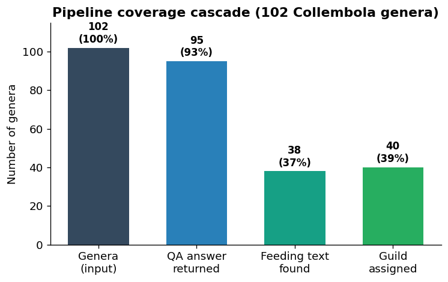
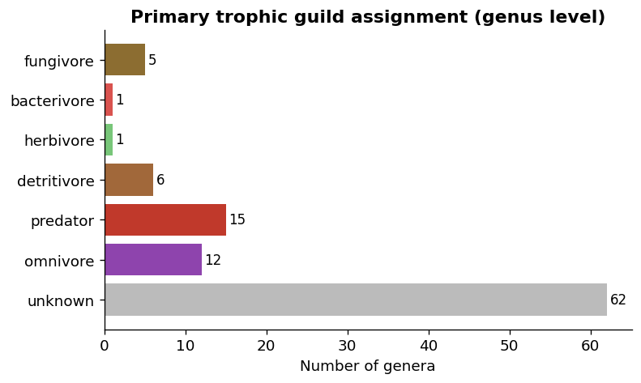
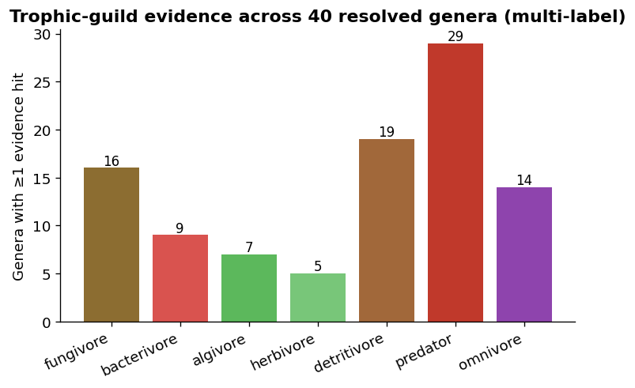
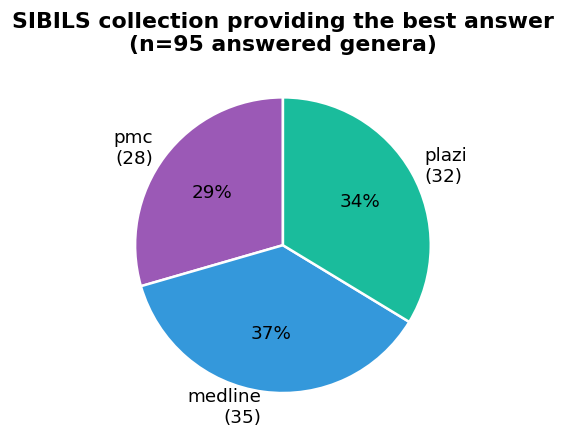
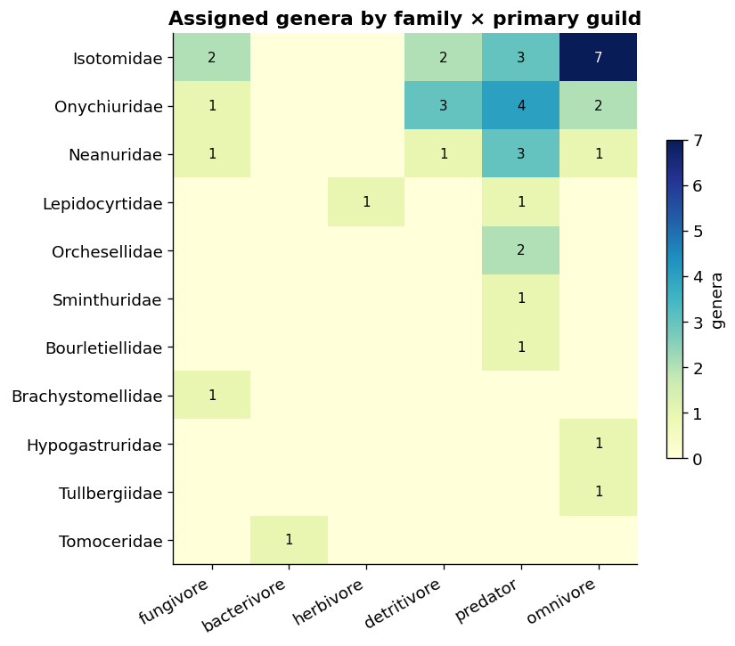

# From Species Lists to Trophic Guilds
### A demonstration pipeline built on SIBILS literature services

**Case study:** 102 Collembola (springtail) genera from a BOLD barcode dataset
**Date:** 2026-07-06
**Services used:** SIBILS QA (generative QA over Medline + Plazi + PMC), BiotXplorer biotic-interaction detection

---

## 1. Executive summary

Ecologists routinely produce **species occurrence lists**, from metabarcoding, from museum
collections, from barcode libraries like BOLD, but those lists carry no *functional*
information. Knowing *which* springtails are in a soil sample tells you little until you know
*what they do*: who eats fungi, who eats bacteria, who is a predator. That functional label is
the **trophic guild**, and it is almost never in the occurrence table.

This report demonstrates an automated pipeline that goes **from a raw species list to a trophic
guild annotation**, using the published literature as the knowledge source and **SIBILS
question-answering as the extraction engine**. No manual literature curation, no hand-built
trait database, the guild is read out of the primary literature on demand.

**Headline result:** starting from 102 genera with *zero* trait information, the pipeline
returned a literature-grounded answer for **95 genera (93 %)** and assigned a defensible
trophic guild to **40 genera (39 %)**, covering **32 % of the 16,029 specimen records** in the
source dataset. Every assignment is traceable back to the exact sentence and source document it
came from.

---

## 2. Why SIBILS QA is the right tool here

The trophic guild of a springtail genus is *latent knowledge*: it is stated somewhere in the
biodiversity and soil-ecology literature, but scattered across taxonomic treatments (Plazi),
abstracts (Medline), and full-text articles (PMC). A keyword search returns hundreds of
documents; it does **not** return an answer.

SIBILS QA closes that last gap. For each genus we ask a single natural-language
question, **"What does *{genus}* feed on?"**, and the service:

1. **retrieves** the most relevant passages across all three collections (Medline, Plazi, PMC),
2. **synthesises** a grounded, cited answer with the Qwen3-8B generative model, and
3. **returns the source passages** so every claim is auditable.

This is the core of the demonstration: **the same QA endpoint that answers biomedical questions
also answers functional-ecology questions**, with no domain-specific retraining.

```
  Species list (BOLD)
        |
        |   "What does {genus} feed on?"
        v
  +---------------------------------------------+
  |  SIBILS QA           (POST /qa, generative) |
  |    retrieve:   Medline + Plazi + PMC        |
  |    synthesise: Qwen3-8B grounded answer     |
  |    return:     answer + cited passages      |
  +---------------------------------------------+
        |  answer text + source passages
        v
  +---------------------------------------------+
  |  BiotXplorer biotic-interaction detection   |
  |    keep sentences that assert an interaction|
  +---------------------------------------------+
        |  feeding evidence
        v
  +---------------------------------------------+
  |  Guild mapper (Potapov et al. 2022 scheme)  |
  |    fungivore / bacterivore / algivore /     |
  |    herbivore / detritivore / predator /     |
  |    omnivore                                 |
  +---------------------------------------------+
        |
        v
  Trophic guild per genus, propagated to every specimen
```

---

## 3. Method

| Stage | Tool | What it does |
|-------|------|--------------|
| 1. Retrieval + QA | SIBILS QA `POST /qa` (generative, sparse) | One question per genus, answered across Medline + Plazi + PMC |
| 2. Evidence filtering | BiotXplorer biotic-interaction detection | Keeps only sentences that assert a biotic interaction |
| 3. Guild mapping | Keyword scheme (Potapov et al. 2022) | Maps answer + evidence to standard soil-fauna guilds |
| 4. Propagation | Genus → specimen join | Assigns each of the 16,029 BOLD records its genus guild |

The guild scheme follows the standard soil-mesofauna classification (Potapov et al. 2022, *Soil
Biology & Biochemistry*): **fungivore, bacterivore, algivore, herbivore, detritivore, predator,
omnivore**. A genus receives every guild for which there is textual evidence; when three or more
guilds are supported it is labelled **omnivore** (a generalist diet).

Reproducible driver: [`scripts/collembola_trophic_batch.py`](../scripts/collembola_trophic_batch.py).
Per-genus QA responses are checkpointed, so the pipeline is fully re-runnable and every answer is
inspectable.

---

## 4. Results

### 4.1 Coverage cascade



The pipeline degrades gracefully. Of 102 genera, **95 got a grounded answer**; explicit feeding
text was found for **38**, and a guild was assigned to **40** (two genera were assignable from
the synthesised answer even without a classifier-flagged sentence). The drop from "answer
returned" to "guild assigned" is not a pipeline failure, it reflects the genuine **silence of
the literature** on the diet of many rare, cave-dwelling, or purely taxonomic genera.

### 4.2 Which guilds were found



Among the 40 resolved genera, the guild distribution is ecologically plausible for Collembola:
a large fungivore/detritivore/omnivore core, a smaller set of specialists, and a predator
fraction that is **partly inflated by a known artefact** (see Limitations §5.1).

Because diet is rarely exclusive, the pipeline is **multi-label**, it records every guild with
supporting evidence, not just the winner:



### 4.3 SIBILS collections pull their weight



All three SIBILS collections contribute best answers, and roughly evenly, **Plazi taxonomic
treatments are as important as Medline abstracts** for this functional question. This is the
value proposition of a unified SIBILS index: the diet fact for an obscure springtail is as
likely to live in a species description as in a physiology paper, and the QA layer reaches both.

### 4.4 Guilds track taxonomy



Assignments cluster sensibly by family, Isotomidae and Onychiuridae dominate the
detritivore/omnivore/fungivore core, matching the known soil-dwelling biology of these groups.
This internal consistency is a useful sanity check: the pipeline is not assigning guilds at
random.

### 4.5 Worked examples: the pipeline at its best

These are cases where SIBILS QA extracted a specific, correct diet from the literature:

| Genus | Guild | What the literature said (via SIBILS QA) |
|:-------------------|:------------|:--------------------------------------------------|
| **Endonura** | fungivore | "…primarily specialised to feed on **slime molds**… morphological adaptations such as the structure of the labrum…" |
| **Orthonychiurus** | fungivore | "…feeds on **slime molds**… some species may also feed on fungal materials or decaying plant matter." |
| **Brachystomella** | fungivore | "…feeds on **fungal structures**, specifically the reproductive tissues of fruiting bodies… consumes spores…" |
| **Agrenia** | algivore | "*A. bidenticulata* feeds on a **biofilm containing terrestrial diatoms**, rich in proteins." |
| **Folsomia** | fungivore | "*F. candida* feeds on **pigmented fungi**, *Cladosporium cladosporioides*, and **yeast** as a food source." |
| **Heteromurus** | omnivore | "…feeds on **fungi** (Agaricomycetes), soil organic material, **nematodes**, and possibly **bacterial** sources, a mixed diet." |

Each of these is backed by a cited source document returned by the QA call, the annotation is
**auditable, not a black-box label**.

### 4.6 Specimen-level output

Propagated to the full barcode dataset, the pipeline annotates **5,121 of 16,029 specimen
records (32 %)** with a trophic guild:

| Primary guild | Specimen records |
|---------------|------------------:|
| predator* | 2,792 |
| omnivore | 1,097 |
| herbivore | 805 |
| fungivore | 349 |
| detritivore | 75 |
| bacterivore | 3 |
| *unknown* | 10,908 |

*\*The predator count is inflated, see §5.1.*

**Deliverables:**
- [`results/collembola_trophic_guilds.csv`](collembola_trophic_guilds.csv), genus level, with answer text, source doc IDs, feeding sentences, and guild(s)
- [`results/collembola_species_guilds.csv`](collembola_species_guilds.csv), one row per BOLD specimen, guild inherited from genus

---

## 5. Limitations

An honest demonstration names its failure modes. This pipeline has three.

### 5.1 Directional confusion in the keyword mapper (predator over-assignment)

The current guild mapper is a **keyword scorer**, and it cannot tell *"X preys on Y"* from
*"Y preys on X"*. Collembola are a favourite prey of mites, beetles, and spiders, so literature
about a springtail frequently contains predation vocabulary in which **the springtail is the
prey, not the predator**. Result: genera such as **Orchesella**, **Sminthurus**, and
**Pseudosinella** were labelled *predator* even though their QA answer explicitly says *"no
specific information regarding the diet."* The predator class is therefore the **least reliable**
in this run, and the specimen-level predator count (2,792) should be treated as an upper bound.

*Fix:* replace the keyword scorer with a directional relation classifier that tracks the subject
and object roles of the predation verb, or add a negation filter that discards predator hits when
the genus is the grammatical object.

### 5.2 "Answered" is not "informative"

93 % of genera got a generative answer, but many answers are a well-formed *"the documents do not
specify the diet."* This is the model behaving correctly, it refuses to hallucinate, but it
means the **93 % answer rate overstates the biological yield**. The honest number is the **39 %
guild-assignment rate**. The gap is a property of the literature, not a bug: rare and cave genera
simply have not had their diets studied.

### 5.3 Genus-level granularity

Guilds are inferred per genus and propagated to all species in that genus. Where congeners differ
in diet (some *Folsomia* are laboratory fungivores, others field generalists), this loses
resolution. Species-level QA ("What does *Folsomia candida* feed on?") is supported by the same
endpoint and would refine this, at higher query cost.

---

## 6. Conclusion

Starting from a plain barcode species list, **SIBILS question-answering turned unstructured
published literature into a structured, auditable trophic-guild annotation** for 40 % of genera
and a third of all specimens, with no manual curation and full provenance on every claim. The
demonstration shows that the SIBILS QA stack generalises cleanly beyond biomedicine into
functional ecology, and that its multi-collection retrieval (Medline **and** Plazi **and** PMC)
is essential to reaching the answer.

The limitations are well understood and each has a concrete remedy:

| Limitation | Remedy | Effort |
|------------|--------|--------|
| Predator directional errors (§5.1) | directional relation classifier tracking subject/object roles | low |
| Low informative yield for rare genera (§5.2) | inherent to literature; add species-level fallback queries | medium |
| Genus-only granularity (§5.3) | per-species QA where congeners diverge | medium |

With the directional fix and species-level names, this same pipeline is a credible route to a
**literature-grounded functional-trait layer** for any taxon SIBILS indexes, springtails today,
any soil or aquatic community next.

---

*Pipeline: [`scripts/collembola_trophic_batch.py`](../scripts/collembola_trophic_batch.py) ·
Data: 102 genera / 16,029 specimens (BOLD) · QA: SIBILS QA (generative) ·
Evidence filter: BiotXplorer biotic-interaction detection*


---


---


---

## Appendix A: Genera with an assigned trophic guild

The **40 genera** for which a guild could be established. The literature passage behind each assignment is given in Appendix B.

| # | Genus | Family | Guild(s) |
|---:|:--------------------|:-------------------|:------------------------------------------------|
| 1 | *Bourletiella* | Bourletiellidae | predator, detritivore |
| 2 | *Brachystomella* | Brachystomellidae | fungivore, detritivore |
| 3 | *Hypogastrura* | Hypogastruridae | omnivore, fungivore, algivore, detritivore, herbivore, predator |
| 4 | *Agrenia* | Isotomidae | omnivore, algivore, bacterivore, herbivore, predator |
| 5 | *Anurophorus* | Isotomidae | predator |
| 6 | *Archisotoma* | Isotomidae | detritivore |
| 7 | *Cryptopygus* | Isotomidae | omnivore, algivore, fungivore, bacterivore, predator, detritivore |
| 8 | *Desoria* | Isotomidae | omnivore, fungivore, predator, detritivore |
| 9 | *Folsomia* | Isotomidae | fungivore, bacterivore, predator, detritivore, omnivore |
| 10 | *Hemisotoma* | Isotomidae | omnivore, fungivore, predator, detritivore |
| 11 | *Pachyotoma* | Isotomidae | fungivore, detritivore |
| 12 | *Parisotoma* | Isotomidae | omnivore, detritivore, fungivore, bacterivore |
| 13 | *Proisotoma* | Isotomidae | detritivore |
| 14 | *Pseudanurophorus* | Isotomidae | predator |
| 15 | *Scutisotoma* | Isotomidae | predator |
| 16 | *Tetracanthella* | Isotomidae | omnivore, algivore, bacterivore, predator |
| 17 | *Vertagopus* | Isotomidae | omnivore, fungivore, herbivore, predator, detritivore |
| 18 | *Lepidocyrtus* | Lepidocyrtidae | herbivore |
| 19 | *Pseudosinella* | Lepidocyrtidae | predator |
| 20 | *Anurida* | Neanuridae | predator |
| 21 | *Deutonura* | Neanuridae | detritivore |
| 22 | *Endonura* | Neanuridae | fungivore |
| 23 | *Friesea* | Neanuridae | predator |
| 24 | *Lathriopyga* | Neanuridae | omnivore, fungivore, algivore, detritivore, predator |
| 25 | *Pseudachorutella* | Neanuridae | predator |
| 26 | *Deuteraphorura* | Onychiuridae | predator |
| 27 | *Heteraphorura* | Onychiuridae | detritivore |
| 28 | *Kalaphorura* | Onychiuridae | detritivore, predator |
| 29 | *Megaphorura* | Onychiuridae | predator |
| 30 | *Onychiuroides* | Onychiuridae | detritivore |
| 31 | *Onychiurus* | Onychiuridae | omnivore, fungivore, predator, detritivore |
| 32 | *Orthonychiurus* | Onychiuridae | fungivore, predator |
| 33 | *Protaphorura* | Onychiuridae | omnivore, algivore, predator, fungivore, bacterivore, detritivore |
| 34 | *Tetrodontophora* | Onychiuridae | predator, bacterivore |
| 35 | *Thalassaphorura* | Onychiuridae | predator |
| 36 | *Heteromurus* | Orchesellidae | predator, fungivore, bacterivore, algivore, omnivore |
| 37 | *Orchesella* | Orchesellidae | predator |
| 38 | *Sminthurus* | Sminthuridae | predator |
| 39 | *Tomocerina* | Tomoceridae | bacterivore |
| 40 | *Mesaphorura* | Tullbergiidae | omnivore, fungivore, herbivore, predator |

## Appendix B: Literature evidence per genus

The grounded SIBILS QA passage behind each guild assignment, with the source document IDs. Where a passage reads *"no specific information…"* the guild rests on a weaker signal and should be treated with caution (see §5.1).

| Genus | Literature evidence (SIBILS QA) | Source |
|:-------------------|:--------------------------------------------------------------------------|:----------------|
| *Bourletiella* | Bourletiella species are mentioned in the context of being collected from leaf litter and soil surfaces, indicating they are detritivores that feed on organic matter such as decaying plant material. However, specific dietary preferences or feeding habits of Bourletiella are not detailed in the sources. | 16883824, 20146862 |
| *Brachystomella* | Brachystomella feeds on fungal structures, specifically the reproductive tissues of fruiting bodies, as evidenced by examples of mammalian mycophagy where Brachystomella sp. consumes spores and other fungal parts. Additionally, Brachystomella parvula is noted to be closely related to hypogeous fungi, suggesting a… | PMC9402283, PMC10603697 |
| *Hypogastrura* | There is no direct mention of what Hypogastrura feeds on. However, it is known that Collembola generally feed on decaying organic matter, algae, lichens, and fungal hyphae. For specific feeding habits of Hypogastrura, further research would be needed. | PMC4569040 |
| *Agrenia* | Agrenia bidenticulata feeds on a biofilm containing terrestrial diatoms, which are rich in proteins. This biofilm is formed on moist surfaces of sand and silt through the activity of diatoms and other microorganisms. Additionally, Agrenia is described as a bryophile species, indicating it may also feed on mosses. | PMC3788365, PMC7240498 |
| *Anurophorus* | There is no specific information regarding the diet or feeding habits of Anurophorus species. The sources discuss taxonomic distinctions and ecological impacts but do not mention what these organisms feed on. Further research would be needed to determine their dietary preferences. | 34186805, 23064850 |
| *Archisotoma* | There is no direct mention of what Archisotoma feeds on. However, it is noted that some species within the family Isotomidae, including those related to Archisotoma, live in environments where they may feed on particles suspended in water or organic matter found in their habitat. Specific dietary preferences for… | Plazi:54C607 |
| *Cryptopygus* | Cryptopygus is part of the Collembola group, which feeds on a wide variety of resources such as leaf litter, fungi, bacteria, roots, and algae. Specifically, the document mentions that Collembola, including species like Cryptopygus, play significant roles in soil ecosystems by regulating microbial biomass and… | PMC12547479 |
| *Desoria* | Desoria ruseki feeds on corn litter and yeast as mentioned in the study. The research indicates that these two food sources led to distinct changes in the microbial communities associated with the Collembola. | 36504791 |
| *Folsomia* | Folsomia candida feeds on various substrates including fungal materials such as pigmented fungi and specific fungal species like Cladosporium cladosporioides. Additionally, they consume yeast as a food source when present in their environment. Their diet may also include organic matter found in soil, potentially… | 15230327, 36424842, 9647845… |
| *Hemisotoma* | Hemisotoma thermophila is noted to be a dominant species in certain environments, but none of the sources explicitly state what Hemisotoma feeds on. However, one source mentions that nineteen out of twenty-four species identified from cotton fields were predominantly fungal feeders. This suggests that Hemisotoma may… | 26313958 |
| *Pachyotoma* | Pachyotoma species are primarily associated with feeding on fungal resources. They are described as mycophagous, meaning they consume fungi, and some species may selectively feed on different fungal species. Additionally, certain Pachyotoma species, like P. crassicauda, are noted to feed on cryoconite, which includes… | PMC3419650, PMC11718624 |
| *Parisotoma* | Parisotoma species are described as decomposers that feed on litter and some fungi. Additionally, they are noted to potentially rely more on bacteria through an external rumen feeding strategy, particularly in hemiedaphic and euedaphic environments. | PMC8453724, PMC10048822 |
| *Proisotoma* | There is no direct information about the feeding habits of Proisotoma. However, it is mentioned that certain species like Proisotoma sepulcralis are associated with decomposing bodies and possibly benefit from the decomposition process, which might involve feeding on organic matter related to decomposition. For more… | 31256818 |
| *Pseudanurophorus* | There is no specific information regarding the diet or feeding habits of Pseudanurophorus barathrum. The document primarily focuses on the taxonomy and morphology of springtails from saline lakes in Russia and China. Further research would be needed to determine its dietary preferences. | 32508499 |
| *Scutisotoma* | There is no specific information regarding the diet of Scutisotoma species. The sources describe the distribution and taxonomy of various Scutisotoma species but do not mention their feeding habits,. Further research would be needed to determine their dietary preferences. | 22371662, 32508499 |
| *Tetracanthella* | There is no explicit information regarding the diet of Tetracanthella. The sources primarily focus on the taxonomy, distribution, and morphological features of Tetracanthella and other Collembola species, but do not specify their dietary habits. Further research would be needed to determine the specific food sources… | PMC7564799, PMC6586687, PMC3088458… |
| *Vertagopus* | Vertagopus species are primarily associated with plant material, particularly young leaves. Under sterile conditions, these leaves are toxic to certain Vertagopus species like V. pseudocinereus, whereas naturally grown leaves are non-toxic and support their growth and reproduction. Specific dietary preferences may… | 17205807 |
| *Lepidocyrtus* | Lepidocyrtus species, including Lepidocyrtus chorus and Lepidocyrtus nigrosetosus, are known to ingest pollen, either directly by visiting flowers or through consumption of wind-borne pollen. However, not all species within the genus possess the digestive capability to break down the pollen wall. | Plazi:A2620B |
| *Pseudosinella* | There is no specific information regarding the diet of Pseudosinella species. The sources focus on taxonomy, morphology, and distribution rather than feeding habits. Further research would be needed to determine their dietary preferences. | 30486077, 32204486, 30313554… |
| *Anurida* | No specific information regarding the diet of Anurida species is given. The sources focus on morphological characteristics, geographic distribution, and behavioral patterns such as tidal synchronization, rather than dietary preferences. Further research would be needed to determine their feeding habits. | 30313303, 34810565, 28311099… |
| *Deutonura* | There is no explicit information regarding the diet or feeding habits of Deutonura species. The sources primarily focus on taxonomic descriptions, geographical distributions, and morphological characteristics of various Deutonura species. Therefore, the feeding ecology of Deutonura remains unspecified in the given… | Plazi:039187, Plazi:039AEC, Plazi:039AEC… |
| *Endonura* | Endonura species are primarily specialized to feed on slime molds. This dietary preference is linked to specific morphological adaptations, such as the structure of the labrum, which allows them to consume certain types of slime molds and thereby reduces interspecies competition. Additionally, it is noted that this… | PMC5523199, Plazi:10.389 |
| *Friesea* | Friesea is known to feed on micro-invertebrates. Some specimens have been found to contain tardigrade claws and rotifer trophi (mouthparts) in their alimentary canals. | Plazi:D9036F |
| *Lathriopyga* | There is no explicit information about the diet of Lathriopyga. However, general knowledge suggests that springtails (Collembola) often feed on decaying organic matter, fungi, algae, and detritus. For specific dietary habits of Lathriopyga, further research would be required. | PMC4467183 |
| *Pseudachorutella* | There is no specific information regarding the feeding habits of Pseudachorutella ellisi sp. nov.. The description focuses on morphological features rather than dietary preferences. | 37518281 |
| *Deuteraphorura* | There is no specific information regarding the diet or feeding habits of Deuteraphorura species. The sources focus on taxonomic descriptions, redescription, and ecological contexts such as cave habitats, but do not mention dietary preferences. Further research would be needed to determine their feeding ecology. | 34811047, 23438196, 27701339… |
| *Heteraphorura* | Heteraphorura species are primarily detritivores, feeding on decaying organic matter such as leaf litter and soil particles. They play a role in decomposing plant material and contributing to nutrient cycling in forest ecosystems. Specific dietary preferences for individual species within the genus are not detailed in… | PMC11203639 |
| *Kalaphorura* | There is no specific information regarding the diet of Kalaphorura. However, it is noted that Kalaphorura carpenteri was associated with site S in scree habitats. Collembola, in general, play a role in decomposing organic matter and contribute to nutrient cycling, suggesting that Kalaphorura may feed on decaying plant… | Plazi:10.389, PMC6305484 |
| *Megaphorura* | There is no specific information regarding the diet of Megaphorura arctica. The sources discuss aspects such as heat tolerance, cryoprotective strategies, and contaminant levels but do not mention feeding habits. Therefore, the dietary preferences of Megaphorura arctica are not addressed in the given context. | 38841875, 23143920, 24816280… |
| *Onychiuroides* | There is no explicit information regarding the diet or feeding habits of Onychiuroides species. The sources primarily focus on taxonomy, distribution, and ecological preferences such as habitat types like soil and leaf litter, but do not specify dietary information for Onychiuroides. Therefore, the feeding ecology of… | Plazi:10.389, Plazi:10.116, Plazi:10.116 |
| *Onychiurus* | There is no direct information about the diet of Onychiurus species. However, given that several Onychiurus species are described as inhabiting mushroom environments, it is possible that they may feed on fungal materials or detritus associated with these habitats. This inference is based on ecological context rather… | 31715768 |
| *Orthonychiurus* | Orthonychiurus feeds on slime molds, as indicated by the mention that "Crossodonthina sp. (which feeds only on slime molds among...". Additionally, some species within the genus may also feed on fungal materials or decaying plant matter, as noted in general descriptions of Collembola. However, specific dietary… | PMC12284588, PMC7808379 |
| *Protaphorura* | Protaphorura feeds on a variety of organic materials including leaf litter, fungi, bacteria, roots, and algae. Additionally, bacterial nutrition was specifically demonstrated in the onychiurid springtail Protaphorura armata. | PMC12547479, Plazi:10.389 |
| *Tetrodontophora* | Tetrodontophora feeds primarily on other small organisms such as springtails and possibly other microorganisms. Specifically, it is noted that Tetrodontophora bielanensis is part of the group where prey items include colored springtails like Hypogastrura sp. or Tetrodontophora sp., although the exact diet may vary… | PMC5602048 |
| *Thalassaphorura* | There is no explicit information regarding the diet of Thalassaphorura. The sources discuss the ecological roles, distribution, and responses of Thalassaphorura to environmental factors, but not their feeding habits. Further research would be needed to determine their specific dietary preferences. | PMC11942941, PMC3419650, PMC5730192… |
| *Heteromurus* | Heteromurus feeds on a variety of substrates including fungi, particularly Agaricomycetes, as well as organic material in soil, nematodes, and possibly bacterial sources. It is noted to consume both fungal and non-fungal materials, indicating a mixed diet. | PMC9968043, PMC9747110, PMC6297133… |
| *Orchesella* | There is no specific information regarding the diet of Orchesella cincta. The sources discuss aspects such as genetics, morphology, and ecological interactions but do not mention feeding habits. Further research would be needed to determine what Orchesella feeds on. | 24398075, 25061350, 21416112… |
| *Sminthurus* | There is no direct mention of what Sminthurus feeds on. However, it is noted that Sminthurus viridis, a species within the genus, is an important pest of winter grain crops and pastures in Australia, suggesting it may feed on plant material. Additionally, the ventral tube structure of Sminthurus viridis indicates… | 32346741 |
| *Tomocerina* | Tomocerina species exhibit dietary shifts influenced by elevation, with evidence suggesting they feed more on microorganisms, microbial residues, or other isotopically enriched resources at higher elevations. Specific details about their exact food sources are not explicitly mentioned in the texts. | PMC10980659 |
| *Mesaphorura* | Mesaphorura species are part of the Collembola group, which includes both detritivorous and herbivorous feeding habits. Specifically, some Collembola, including Mesaphorura, can consume plant tissue and fine roots, acting as herbivores. Additionally, many Collembola and Oribatida are mycophagous, meaning they feed on… | PMC7380278, PMC3419650 |

## Appendix C: Genera without an assigned guild

The **62 genera** for which no guild could be established.

| # | Genus | Family | Status |
|---:|:--------------------|:-------------------|:----------------------------|
| 1 | *Arrhopalites* | Arrhopalitidae | diet not documented in literature |
| 2 | *Pygmarrhopalites* | Arrhopalitidae | diet not documented in literature |
| 3 | *Dicyrtoma* | Dicyrtomidae | diet not documented in literature |
| 4 | *Dicyrtomina* | Dicyrtomidae | diet not documented in literature |
| 5 | *Entomobrya* | Entomobryidae | diet not documented in literature |
| 6 | *Willowsia* | Entomobryidae | diet not documented in literature |
| 7 | *Ceratophysella* | Hypogastruridae | diet not documented in literature |
| 8 | *Choreutinula* | Hypogastruridae | diet not documented in literature |
| 9 | *Mesogastrura* | Hypogastruridae | diet not documented in literature |
| 10 | *Schoettella* | Hypogastruridae | diet not documented in literature |
| 11 | *Willemia* | Hypogastruridae | diet not documented in literature |
| 12 | *Xenylla* | Hypogastruridae | diet not documented in literature |
| 13 | *Ballistura* | Isotomidae | diet not documented in literature |
| 14 | *Folsomides* | Isotomidae | diet not documented in literature |
| 15 | *Gnathisotoma* | Isotomidae | diet not documented in literature |
| 16 | *Halisotoma* | Isotomidae | diet not documented in literature |
| 17 | *Isotoma* | Isotomidae | diet not documented in literature |
| 18 | *Isotomiella* | Isotomidae | diet not documented in literature |
| 19 | *Isotomodes* | Isotomidae | name absent from SIBILS corpus (verify for synonymy or misID) |
| 20 | *Isotomurus* | Isotomidae | diet not documented in literature |
| 21 | *Marisotoma* | Isotomidae | name absent from SIBILS corpus (verify for synonymy or misID) |
| 22 | *Proisotomodes* | Isotomidae | diet not documented in literature |
| 23 | *Pseudisotoma* | Isotomidae | diet not documented in literature |
| 24 | *Subisotoma* | Isotomidae | diet not documented in literature |
| 25 | *Gisinianus* | Katiannidae | name absent from SIBILS corpus (verify for synonymy or misID) |
| 26 | *Katianna* | Katiannidae | diet not documented in literature |
| 27 | *Rusekianna* | Katiannidae | diet not documented in literature |
| 28 | *Sminthurinus* | Katiannidae | diet not documented in literature |
| 29 | *Cyphoderus* | Lepidocyrtidae | diet not documented in literature |
| 30 | *Bilobella* | Neanuridae | diet not documented in literature |
| 31 | *Micranurida* | Neanuridae | diet not documented in literature |
| 32 | *Monobella* | Neanuridae | diet not documented in literature |
| 33 | *Neanura* | Neanuridae | diet not documented in literature |
| 34 | *Pseudachorutes* | Neanuridae | diet not documented in literature |
| 35 | *Thaumanura* | Neanuridae | diet not documented in literature |
| 36 | *Megalothorax* | Neelidae | diet not documented in literature |
| 37 | *Neelides* | Neelidae | name absent from SIBILS corpus (verify for synonymy or misID) |
| 38 | *Neelus* | Neelidae | diet not documented in literature |
| 39 | *Superodontella* | Odontellidae | diet not documented in literature |
| 40 | *Xenyllodes* | Odontellidae | diet not documented in literature |
| 41 | *Oncopodura* | Oncopoduridae | diet not documented in literature |
| 42 | *Absolonia* | Onychiuridae | diet not documented in literature |
| 43 | *Cribrochiurus* | Onychiuridae | name absent from SIBILS corpus (verify for synonymy or misID) |
| 44 | *Detriturus* | Onychiuridae | name absent from SIBILS corpus (verify for synonymy or misID) |
| 45 | *Hymenaphorura* | Onychiuridae | diet not documented in literature |
| 46 | *Oligaphorura* | Onychiuridae | diet not documented in literature |
| 47 | *Supraphorura* | Onychiuridae | diet not documented in literature |
| 48 | *Troglopedetes* | Paronellidae | diet not documented in literature |
| 49 | *Podura* | Poduridae | diet not documented in literature |
| 50 | *Seira* | Seiridae | diet not documented in literature |
| 51 | *Allacma* | Sminthuridae | diet not documented in literature |
| 52 | *Lipothrix* | Sminthuridae | name absent from SIBILS corpus (verify for synonymy or misID) |
| 53 | *Sminthurides* | Sminthurididae | diet not documented in literature |
| 54 | *Sphaeridia* | Sminthurididae | diet not documented in literature |
| 55 | *Stenacidia* | Sminthurididae | diet not documented in literature |
| 56 | *Plutomurus* | Tomoceridae | diet not documented in literature |
| 57 | *Pogonognathellus* | Tomoceridae | diet not documented in literature |
| 58 | *Tomocerus* | Tomoceridae | diet not documented in literature |
| 59 | *Tritomurus* | Tomoceridae | diet not documented in literature |
| 60 | *Metaphorura* | Tullbergiidae | diet not documented in literature |
| 61 | *Paratullbergia* | Tullbergiidae | diet not documented in literature |
| 62 | *Stenaphorura* | Tullbergiidae | diet not documented in literature |
